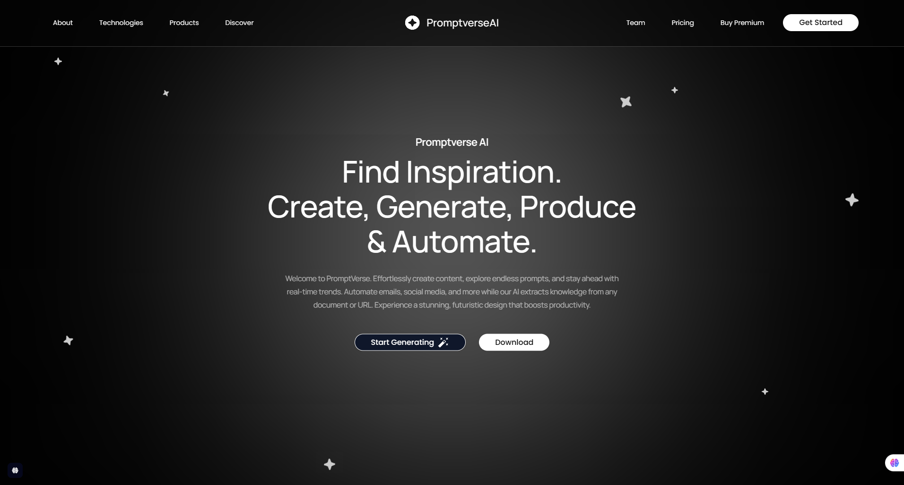
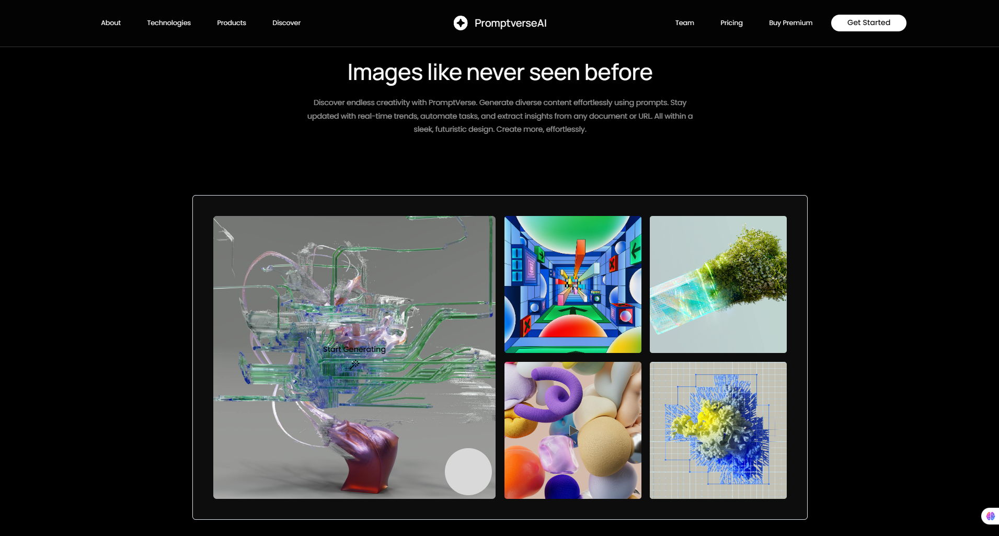

# PromptVerse AI - Landing Page

A modern, responsive landing page for PromptVerse AI - an innovative platform for AI-powered content generation.



## 🚀 Features

- **Responsive Design** - Fully adaptive across all screen sizes
- **GSAP Animations** - Smooth animations and scroll-triggered effects
- **Modern UI** - Built with Shadcn UI components
- **TypeScript** - Full type safety
- **Tailwind CSS** - Utility-first styling
- **Vite** - Fast development and build



## 🛠️ Tech Stack

- **React 18** - Frontend framework
- **TypeScript** - Static type checking
- **Tailwind CSS** - CSS framework
- **GSAP** - Animation library with ScrollTrigger
- **Shadcn UI** - Reusable component library
- **Radix UI** - Accessible UI primitives
- **Lucide React** - Beautiful icons
- **Vite** - Build tool and dev server

## 📋 Prerequisites

- Node.js 16.0 or higher
- npm or yarn package manager

## 🔧 Installation

1. Clone the repository:
```bash
git clone <repository-url>
cd project
```

2. Install dependencies:
```bash
npm install
```

3. Start the development server:
```bash
npm run dev
```

4. Open [http://localhost:5176](http://localhost:5176) in your browser

## 📦 Scripts

- `npm run dev` - Start development server
- `npm run build` - Build for production

## 🗂️ Project Structure

```
src/
├── components/
│   └── ui/           # Reusable UI components
├── hooks/            # Custom React hooks
├── lib/              # Utility functions
└── screens/
    └── Design/       # Main application screens
        └── sections/ # Page sections
```

## 🎨 Sections

The landing page includes several key sections:

- **Hero Section** - Main introduction with navigation
- **Content Section** - Features and capabilities showcase
- **Main Content Section** - Prompt examples and use cases
- **Footer Section** - Contact information and links

## ✨ Key Features Showcase

- **AI Image Generation** - Create stunning visuals with AI
- **Audio & Music Creation** - Generate realistic AI voices and music
- **Content Automation** - Automate emails, social media, and more
- **Document Analysis** - Extract insights from any document or URL
- **Real-time Trends** - Stay updated with latest content trends

## 🎯 Performance Features

- Optimized images and assets
- Lazy loading for better performance
- Smooth scroll animations
- Mobile-first responsive design

## 🔧 Customization

The project uses Tailwind CSS for styling. You can customize:

- Colors in `tailwind.config.js`
- Fonts in the HTML head
- Component styles in individual component files

## 📱 Browser Support

- Chrome (latest)
- Firefox (latest)
- Safari (latest)
- Edge (latest)

## 🤝 Contributing

1. Fork the repository
2. Create a feature branch
3. Make your changes
4. Submit a pull request

## 📄 License

This project is licensed under the MIT License.

## 📞 Contact

For questions or support, please contact the development team.

---

Built with ❤️ for the future of AI-powered content creation.